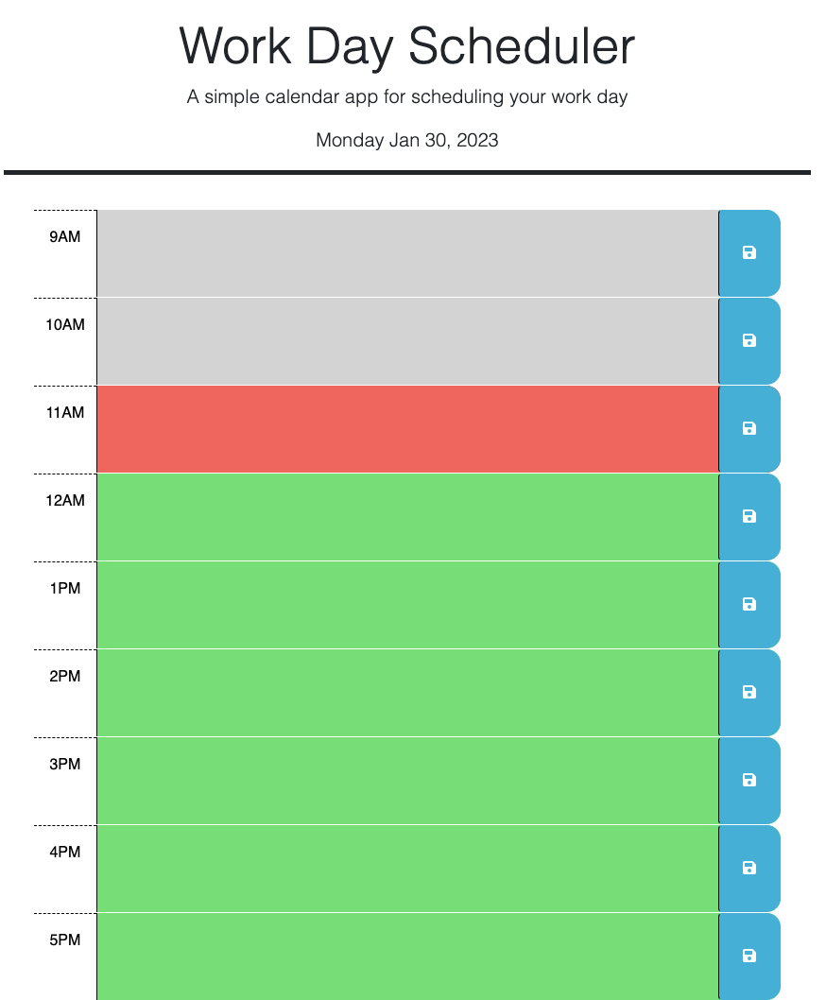

# Work Day Scheduler: your daily schedule

## Description

This is a workday scheduler that allows the user to see the current local time and type there schedule using time blocks based on a 9 hour day (9am - 5pm). These time blocks have a text area and save button so the user can type their schedule in based on the hour they are wanting to have it completed/reminded and save it to the browsers local storage. After exiting or refreshing the website, the text the user entered will still be present. Also there is a color code system that highlights the current hour (time block) as red, past hours as gray, and future hours as green.

## Task completed

- Created a clock with the current date and time in the header
- Linked the save button to save entered text into local storage
- Pull data from local storage upon refresh or reentering webpage
- Linking time blocks with color based on past, present, and future time in relation to the current time

## Link

[Link to deployed website]()

[Link to Repository](https://github.com/AaronDreyer/your-daily-schedule)

## Installation

Access application through github by deploying index.html, style.css, javascript, and README.md

Links above bring user to deployed page and github repository

## Usage

THis application uses jQuery, day.js, javascript, and html to establish a website that is interactable based on time. This shows an example of how Third-Party APIs function and how they can be used in relation to javascript to make an application. The current time can be displayed with day.js and the javascript can be done with assistance from jQuery.

## Credits

Credit for the total completion of assignment include: TAs, instructor, and students of the 2022 Georgia Tech Coding Bootcamp. Their assistance allowed for the assignment to meet all requirements.

Following Websites were used:

- https://stackoverflow.com/
- https://day.js.org/
- https://jquery.com/
- https://momentjs.com/
- https://github.com/topics/workday-scheduler

## License

License provided by Georgia Tech Bootcamp.

External liscense not specified.

